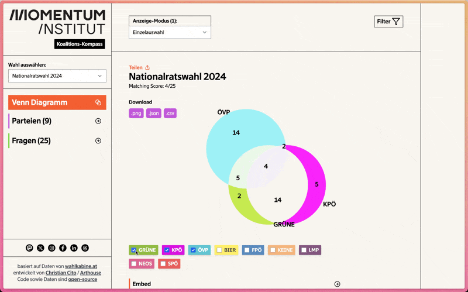

# Momentum Coalition Compass



Made by [Christian Cito](https://chrcit.com) / [Arthouse](https://madebyarthouse.com) in collaboration with [Momentum Institut](https://momentum-institut.at).

Application for analysing and visualizing data from the political questionnaire [wahlkabine.at](https://wahlkabine.at).

## Stack

- Vite
- React
- `chart.js` + `chartjs-chart-venn`
- Tailwind
- Framer Motion


## Development

```bash
# install
npm install
```
```bash
# dev
npm run dev
```
```bash
# build
npm run build
```

### (Pre) Process Data
The data was manually extracted from the [wahlkabine.at](https://wahlkabine.at) website. 
The full dataset is stored in `src/wahlkabine-data/data.json`.

After running the `process-data` command all neccessary data is extracted to `src/wahlkabine-data/data-minimal.json`.

```bash
npm run process-data
```

After that the `data-minimal.json` file needs to be placed in the `public/` folder so it can be fetched from the client.

### Build embed widget
It's possible to embed a single election venn diagramm on other websites.

To build the needed `momentum-venn.js` & `style.css` files you need to run the `build:lib` command.

```bash
# build widget
npm run build:lib
```

The command bundles the code needed for the embed widget and copies it to the public folder.

## Deployment / Static Hosting

This is a pure client-side application and can be deployed to any (static) hosting service.

## License

Creative Commons Attribution-NonCommercial-ShareAlike 4.0 International.

See [LICENSE](./LICENSE.md)
